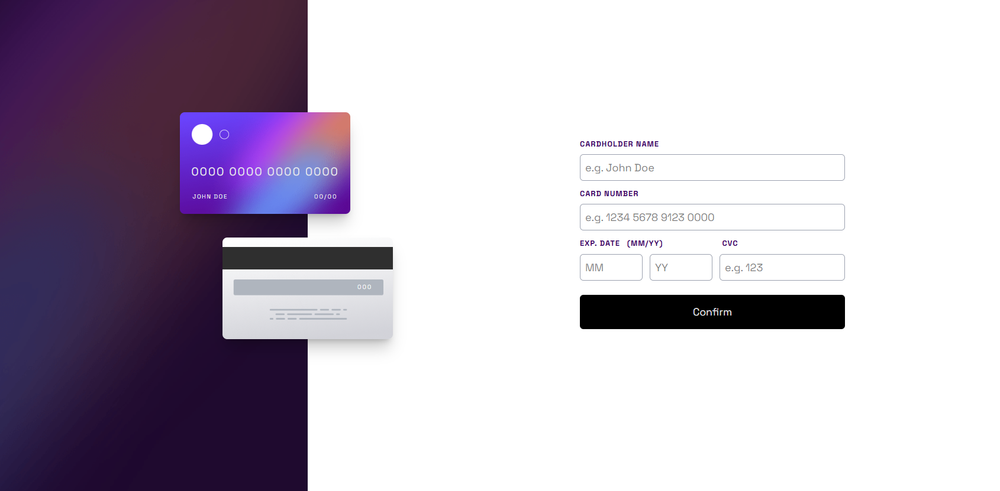

# 💳 Interaktive Kreditkarten-Formular-App

Willkommen! 👋  
Dieses Projekt ist Teil einer Frontend Mentor Challenge – Ziel war es, ein realistisches Frontend-Projekt umzusetzen, um HTML, CSS und JavaScript zu trainieren.

## 📸 Vorschau

---

## 🚀 Projektziel

Das Ziel dieser Übung war es, ein interaktives Formular für Kreditkartendaten zu erstellen – inklusive Live-Vorschau, Validierung und Responsive Design.

---

## 🔧 Features

- ✅ **Live-Vorschau** der Kreditkartendaten beim Eintippen
- ❌ **Fehlermeldungen** bei leeren oder fehlerhaften Eingaben
- 📱 **Responsive Design** – passt sich Desktop & Mobilgeräten an
- 🎯 **Eingabe-Validierung** für:
- Name (mind. 5 Zeichen)
- Kreditkartennummer (16 Ziffern, Format mit Leerzeichen)
- Ablaufdatum (MM/YY)
- CVC (3-stellig)
- ✨ Hover-, Focus- und aktive Zustände für Buttons & Inputs

---

## 🛠️ Verwendete Technologien

- HTML5
- Tailwind CSS (inkl. Mobile First Design)
- JavaScript (ohne Framework)

---

## 📂 Projektstruktur

├── assets/
│ └── script/
│ └── main.js # Hauptlogik inkl. Live-Vorschau und Validierung
├── images/ # Optimierte Assets (Hintergründe, Icons)
├── index.html # Hauptstruktur
└── README.md # Du bist hier 😄

---

## 🧪 Gelernt

- DOM-Manipulation und Events in JS
- Formatierung von Eingabefeldern (z. B. 1234 5678 1234 0000)
- Tailwind Utility-Klassen für responsive Layouts
- Validierungslogik mit Fehlerausgabe
- UX-Details wie Fokuszustände und Fehlermeldungen

---

## 📦 Installation

git clone https://github.com/mr-maddin/interactive-card.git

---

✍️ Autor

Martin [@mr-maddin]
Made with ❤️ and a lot of JavaScript debugging 😅

📢 Feedback oder Fragen?

Gerne einfach im Frontend Mentor Forum posten oder per GitHub-Issue melden!
Ich freue mich auf Austausch und Tipps zum Code ✌️

🏁 Credits

Challenge by Frontend Mentor.
Design-Vorlage & Assets stammen aus dem offiziellen Challenge-Repository.

Have fun & keep coding 💻🚀
